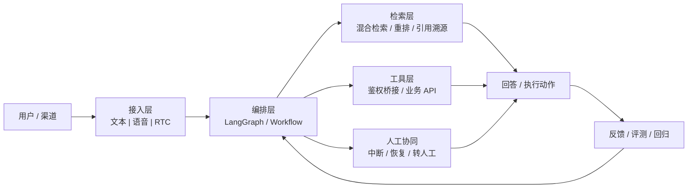

<p align="center">
  
</p>

<p align="center">
  <a href="mailto:2041487752dxj@gmail.com">
    
  </a>
  <a href="https://github.com/byteD-x">
    
  </a>
  <a href="https://my-resume-gray-five.vercel.app/">
    
  </a>
  
  
</p>

```text
你好，我是 byteD-x。

AI 应用工程师，专注 RAG、Agent、多模态 AI 与生产级系统落地。
我更关心真实业务场景里的稳定性、成本、可观测性和可验证结果。
```

## 我在做什么

我专注把 LLM 能力接到真实业务里，做的是能上线、能观测、能回归、能解释的 AI 系统。

| 方向 | 我实际在做什么 |
| --- | --- |
| 检索与编排 | 混合检索、引用链路、LangGraph 工作流、可恢复执行 |
| 多模态接入 | 文本 / 语音 / RTC 接入、业务工具调用、Auth Bridge、人工接管 |
| 性能与成本 | 提速、缓存治理、Token 成本压缩、评测回归、稳定性基线 |

## 我做的系统长什么样



## 技术栈

**核心栈**


**交付栈**


**也做过这些**


## 代表项目

<table>
  <tr>
    <td width="50%" valign="top">
      <strong><a href="https://github.com/byteD-x/customer-ai-runtime">customer-ai-runtime</a></strong><br />
      企业级智能客服运行时，支持文本 / 语音 / RTC，多渠道接入与人工协同接管。<br /><br />
      <code>Python</code> <code>FastAPI</code> <code>AsyncIO</code> <code>LangGraph</code> <code>Qdrant</code><br /><br />
      
      
    </td>
    <td width="50%" valign="top">
      <strong><a href="https://github.com/byteD-x/rag-qa-system">rag-qa-system</a></strong><br />
      企业知识问答平台，多源文档接入、混合检索、答案引用溯源与评测回归。<br /><br />
      <code>Python</code> <code>FastAPI</code> <code>LangGraph</code> <code>PostgreSQL</code> <code>Vue 3</code><br /><br />
      
      
    </td>
  </tr>
  <tr>
    <td width="50%" valign="top">
      <strong><a href="https://github.com/byteD-x/wechat-bot">wechat-bot</a></strong><br />
      微信 PC 端 AI 助手，包含长期记忆、多模型支持、情感识别与 Electron 管理端。<br /><br />
      <code>Python</code> <code>Quart</code> <code>AsyncIO</code> <code>Electron</code> <code>wxauto</code><br /><br />
      
      
    </td>
    <td width="50%" valign="top">
      <strong><a href="https://github.com/byteD-x/easyCloudPan">easyCloudPan</a></strong><br />
      企业级网盘系统，前后端分离、多租户隔离、完整权限体系与高性能上传。<br /><br />
      <code>Java 21</code> <code>Spring Boot 3.x</code> <code>Vue 3</code> <code>React 19</code><br /><br />
      
      
    </td>
  </tr>
</table>

## 做出过的结果

这些不是“会一点”的技能标签，而是做过并留下结果的工程信号。

| 事项 | 结果 |
| --- | --- |
| 报表性能优化 | `20s+ -> 4s`，约 `5x` 提速 |
| AI 成本优化 | Token 成本下降 `40%` |
| 数据迁移 | `300+` 表、`3e8+` 记录无损迁移 |
| 交付方式 | 从需求澄清到上线闭环，强调回归与可验证性 |

## 职业经历

| 时间 | 角色 | 事项 |
| --- | --- | --- |
| `2026.02 - 至今` | 独立开发者 | 持续开发智能客服运行时、RAG-QA 系统、微信 AI 助手等开源项目 |
| `2025.11 - 2025.12` | 外包技术顾问 @ 南方科技大学 | 智能流程自动化原型，从需求澄清到闭环交付 |
| `2025.04 - 2025.09` | 后端 / 全栈工程师 @ 中软国际 | 企业知识问答系统研发，负责 RAG 设计、LangGraph 运行时、评测回归 |
| `2024.08 - 2024.10` | 后端开发实习生 @ 国家骨科临床研究中心 | 论文检索小程序后端，AI 搜索与订阅推送 |
| `2024.05 - 2024.08` | 后端开发实习生 @ 中国联通陕西省分公司 | 运营平台建设，性能优化与大规模数据迁移 |
| `2024.04 - 2026.02` | 全栈开发 @ 开源项目 | EasyCloudPan 网盘系统开发与维护 |

## GitHub 活跃轨迹

### 🐍 提交贡献蛇形动画

<p align="center">
  <picture>
    <source media="(prefers-color-scheme: dark)" srcset="https://github.com/byteD-x/byteD-x/blob/output/github-contribution-grid-snake-dark.svg" />
    <source media="(prefers-color-scheme: light)" srcset="https://github.com/byteD-x/byteD-x/blob/output/github-contribution-grid-snake.svg" />
    
  </picture>
</p>

### 📊 活动统计

<p align="center">
  <a href="https://github.com/ashutosh00710/github-readme-activity-graph">
    
  </a>
</p>

### 🔥 贡献热度

<p align="center">
  <a href="https://git.io/streak-stats">
    
  </a>
</p>

<details>
  <summary><strong>联系方式</strong></summary>
  <br />

  - 邮件：`2041487752dxj@gmail.com`
  - 微信：`w2041487752`
  - GitHub：[`@byteD-x`](https://github.com/byteD-x)
  - 作品集：[`my-resume-gray-five.vercel.app`](https://my-resume-gray-five.vercel.app/)
  - 合作方向：`RAG / Agent`、`LLM 生产化`、`性能优化`、`技术咨询`
</details>

---

<p align="center">
  <code>最后更新：2026-03-13</code>
</p>
