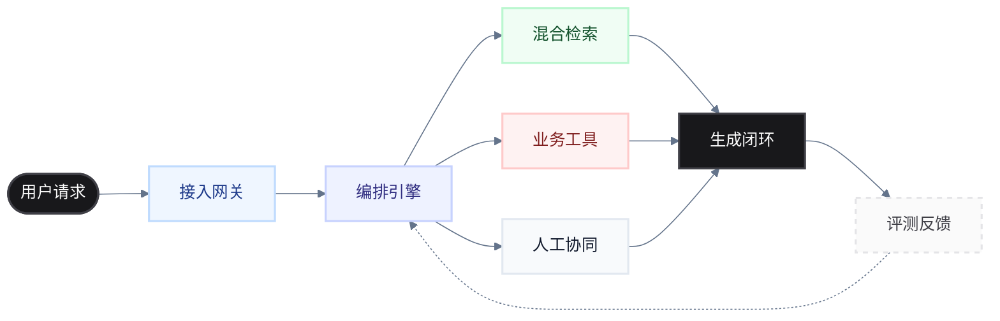

<h1 align="center">byteD-x</h1>

  <strong>AI Systems / RAG / Agent Engineering / Backend & Full Stack</strong>

  构建可恢复、可追踪、可评测的 AI 应用与工程基础设施。

  
  
  
  
  

 

### 核心聚焦

<table>
  <tr>
    <td width="33%" valign="top">
      <h4>检索与编排</h4>
      
混合检索、引用链路溯源、LangGraph 工作流、可恢复执行的 Agent 架构。

    </td>
    <td width="33%" valign="top">
      <h4>多模态与协同</h4>
      
文本 / 语音 / RTC 全渠道接入、业务工具调用、Auth Bridge 与人工接管机制。

    </td>
    <td width="33%" valign="top">
      <h4>性能与治理</h4>
      
系统提速、缓存治理、Token 成本压缩 40%+、评测回归体系与稳定性基线建设。

    </td>
  </tr>
</table>

### 架构视图

### 技术栈

  <b>核心架构：</b> 
  
  
  
  
  
  
  

  <b>交付基建：</b> 
  
  
  
  
  
  

### 代表项目

  以下内容由 GitHub 实时仓库数据自动生成，当前按星标、分叉和最近活跃度综合排序；描述信息每 15 分钟刷新一次，星标、分叉和最近提交通过动态徽章实时同步。

<!-- representative-projects:start -->
<table width="100%" style="border-collapse: collapse; border: none;">
  <tr>
    <td width="50%" valign="top" style="border: 1px solid #E4E4E7; padding: 16px;">
      <h4><a href="https://github.com/byteD-x/wechat-bot" style="color: #2563EB; text-decoration: none;">wechat-bot</a></h4>
      
基于 wxauto 的微信 PC 端 AI 自动回复机器人，支持多模型 API 与各种oauth（OpenAI/DeepSeek/豆包等），支持各种coding plan (Kimi，GLM，codex team等)，内置记忆、情感识别与 Electron 可视化界面。

      <code>Python</code>
        
      
      
      
    </td>
    <td width="50%" valign="top" style="border: 1px solid #E4E4E7; padding: 16px;">
      <h4><a href="https://github.com/byteD-x/easyCloudPan" style="color: #2563EB; text-decoration: none;">easyCloudPan</a></h4>
      
高性能前后端分离网盘系统，支持 Vue 3 和 React 19 双前端，基于 Java 21 虚拟线程和 Spring Boot 3.x 构建。

      <code>Java</code>
        
      
      
      
    </td>
  </tr>
  <tr>
    <td width="50%" valign="top" style="border: 1px solid #E4E4E7; padding: 16px;">
      <h4><a href="https://github.com/byteD-x/rag-qa-system" style="color: #2563EB; text-decoration: none;">rag-qa-system</a></h4>
      
企业级 RAG 问答系统 | 多源知识连接器 | 分片审查 | 检索调试 | 平台治理能力

      <code>Python</code>
        
      
      
      
    </td>
    <td width="50%" valign="top" style="border: 1px solid #E4E4E7; padding: 16px;">
      <h4><a href="https://github.com/byteD-x/customer-ai-runtime" style="color: #2563EB; text-decoration: none;">customer-ai-runtime</a></h4>
      
企业级智能客服引擎，支持 RAG 知识增强、AI/人工协同、模块化接入。提供文本/语音/RTC 多渠道客服能力，可作为 FastAPI 子应用无缝集成到现有业务系统。

      <code>Python</code>
        
      
      
      
    </td>
  </tr>
</table>
<!-- representative-projects:end -->

### 履历与产出

<table width="100%">
  <tr>
    <th width="25%" align="left">时间线</th>
    <th width="30%" align="left">角色与组织</th>
    <th width="45%" align="left">核心产出</th>
  </tr>
  <tr>
    <td><code>2025.11 - 2025.12</code></td>
    <td>外包技术顾问 <em>@南方科技大学</em></td>
    <td>智能流程自动化原型开发，完成从需求澄清到架构设计的闭环交付。</td>
  </tr>
  <tr>
    <td><code>2025.04 - 2025.09</code></td>
    <td>后端 / 全栈工程师 <em>@中软国际</em></td>
    <td>企业知识问答系统研发。设计 RAG 架构与 LangGraph 运行时，Token 成本优化 <b>40%</b>。</td>
  </tr>
  <tr>
    <td><code>2024.08 - 2024.10</code></td>
    <td>后端实习生 <em>@国家骨科临床研究中心</em></td>
    <td>论文检索系统构建。实现高可用 AI 搜索与定向订阅推送闭环。</td>
  </tr>
  <tr>
    <td><code>2024.05 - 2024.08</code></td>
    <td>后端实习生 <em>@中国联通陕西分公司</em></td>
    <td>大规模数据迁移（300+表，3亿级记录）。报表查询性能优化 <b>5x</b>（20s -> 4s）。</td>
  </tr>
</table>

### 活动指标

 

 

### Pixel Arcade // Contribution Grid

  

 

  <code style="color: #A1A1AA;">systemctl status byteD-x --no-pager</code>

