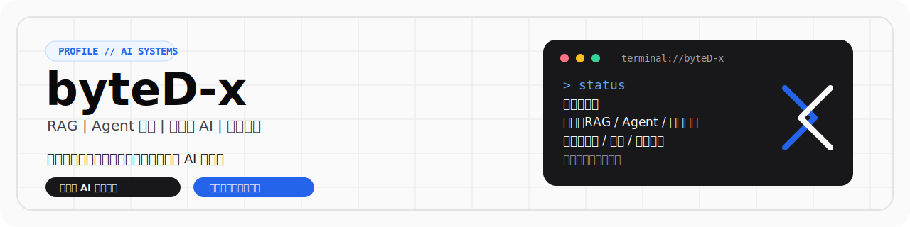

  

  
  
  
  
  

 

  

 

### 核心聚焦

<table>
  <tr>
    <td width="33%" valign="top">
      <h4>检索与编排</h4>
      
混合检索、引用链路溯源、LangGraph 工作流、可恢复执行的 Agent 架构。

    </td>
    <td width="33%" valign="top">
      <h4>多模态与协同</h4>
      
文本 / 语音 / RTC 全渠道接入、业务工具调用、Auth Bridge 与人工接管机制。

    </td>
    <td width="33%" valign="top">
      <h4>性能与治理</h4>
      
系统提速、缓存治理、Token 成本压缩 40%+、评测回归体系与稳定性基线建设。

    </td>
  </tr>
</table>

### 架构视图

### 技术栈

  <b>核心架构：</b> 
  
  
  
  
  
  
  

  <b>交付基建：</b> 
  
  
  
  
  
  

### 代表项目

<table width="100%" style="border-collapse: collapse; border: none;">
  <tr>
    <td width="50%" valign="top" style="border: 1px solid #E4E4E7; padding: 16px;">
      <h4><a href="https://github.com/byteD-x/customer-ai-runtime" style="color: #2563EB; text-decoration: none;">customer-ai-runtime</a></h4>
      
企业级智能客服运行时。支持文本、语音、RTC 多渠道接入与人工协同接管。

      <code>Python</code> <code>LangGraph</code> <code>Qdrant</code>
        
      
    </td>
    <td width="50%" valign="top" style="border: 1px solid #E4E4E7; padding: 16px;">
      <h4><a href="https://github.com/byteD-x/rag-qa-system" style="color: #2563EB; text-decoration: none;">rag-qa-system</a></h4>
      
企业知识问答平台。多源文档接入、混合检索、答案引用溯源与评测回归。

      <code>FastAPI</code> <code>PostgreSQL</code> <code>Vue 3</code>
        
      
    </td>
  </tr>
  <tr>
    <td width="50%" valign="top" style="border: 1px solid #E4E4E7; padding: 16px;">
      <h4><a href="https://github.com/byteD-x/wechat-bot" style="color: #2563EB; text-decoration: none;">wechat-bot</a></h4>
      
微信 PC 端 AI 助手。包含长期记忆、多模型路由、情感识别与管理后台。

      <code>AsyncIO</code> <code>Electron</code> <code>wxauto</code>
        
      
    </td>
    <td width="50%" valign="top" style="border: 1px solid #E4E4E7; padding: 16px;">
      <h4><a href="https://github.com/byteD-x/easyCloudPan" style="color: #2563EB; text-decoration: none;">easyCloudPan</a></h4>
      
企业级网盘系统。多租户隔离、完整权限体系与高性能分片上传。

      <code>Spring Boot</code> <code>React 19</code>
        
      
    </td>
  </tr>
</table>

### 履历与产出

<table width="100%">
  <tr>
    <th width="25%" align="left">时间线</th>
    <th width="30%" align="left">角色与组织</th>
    <th width="45%" align="left">核心产出</th>
  </tr>
  <tr>
    <td><code>2025.11 - 2025.12</code></td>
    <td>外包技术顾问 <em>@南方科技大学</em></td>
    <td>智能流程自动化原型开发，完成从需求澄清到架构设计的闭环交付。</td>
  </tr>
  <tr>
    <td><code>2025.04 - 2025.09</code></td>
    <td>后端 / 全栈工程师 <em>@中软国际</em></td>
    <td>企业知识问答系统研发。设计 RAG 架构与 LangGraph 运行时，Token 成本优化 <b>40%</b>。</td>
  </tr>
  <tr>
    <td><code>2024.08 - 2024.10</code></td>
    <td>后端实习生 <em>@国家骨科临床研究中心</em></td>
    <td>论文检索系统构建。实现高可用 AI 搜索与定向订阅推送闭环。</td>
  </tr>
  <tr>
    <td><code>2024.05 - 2024.08</code></td>
    <td>后端实习生 <em>@中国联通陕西分公司</em></td>
    <td>大规模数据迁移（300+表，3亿级记录）。报表查询性能优化 <b>5x</b>（20s -> 4s）。</td>
  </tr>
</table>

### 活动指标

 

 

  <code style="color: #A1A1AA;">systemctl status byteD-x --no-pager</code>

